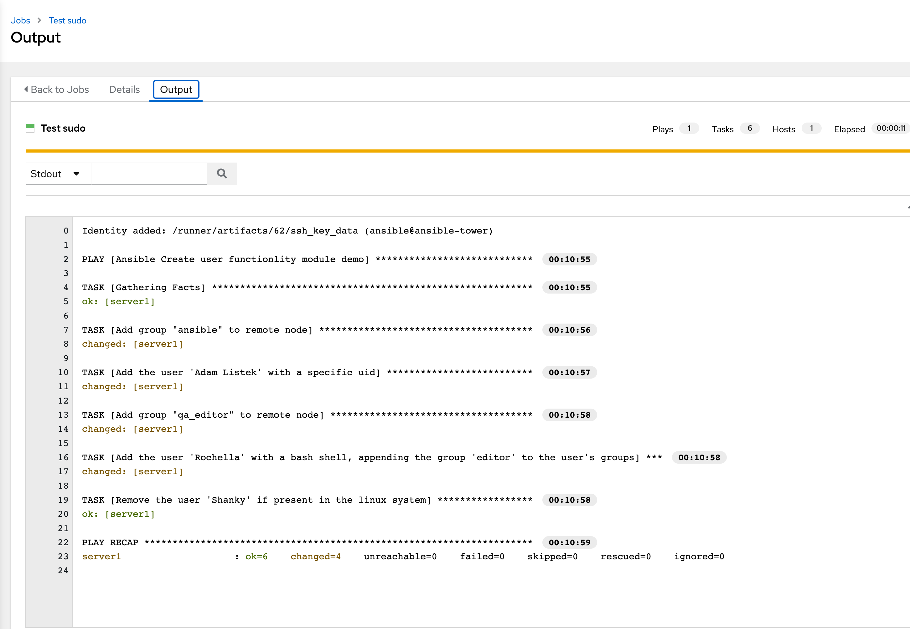

# AAP - Projects and Job Templates

An Automation Platform **Project** is a logical collection of Ansible playbooks. You can manage your playbooks by placing them into a source code management (SCM) system supported by AAP, including Git/GitHub, Subversion, and Mercurial.

You should definitely keep your playbooks under version control. In this lab we’ll use playbooks that are provided in a GitHub repository.


## Setup Git Repository

For this lab we will use a playbook stored in this Git repository

[https://github.com/jruels/workshop-examples](https://github.com/jruels/workshop-examples)

A playbook to manage users, and groups. The playbook is `create_user.yml`

```yaml
---
- name: Ansible Create user functionlity module demo
  hosts: web # Defining the remote server inventory host group
  become: yes
  # Defining the remote server where the ansible create user module
  # will manage the objects
  remote_user: ansible # Using Remote user as ubuntu
  tasks:

  # name - Defines the username that is present or to create
  # groups - Adds users in secondary groups or use groups
  # state: present - Creates a user or works with a user
  # state: absent - Deletes a user
  # shell - Specifies shell-type a user can work on
  # home - Sets a user’s home directory
  # createhome: yes - Create a home directory for a user
  # createhome: no - Do not create a home directory for a user

    # Adding the ansible group
    - name: Add group "ansible" to remote node
      group:
        name: ansible
        gid: 2245
        state: present


  # Creating the user Adam Listek
    - name: Add the user 'Adam Listek' with a specific uid
      ansible.builtin.user:
        name: adamlis
        comment: AdamListek
        uid: 1077
        group: ansible
        createhome: yes        # Defaults to yes
        home: /home/adamlis    # Defaults to /home/<username>

  # Adding the user qa_editor in the editor group
    - name: Add group "qa_editor" to remote node
      group:
        name: qa_editor
        gid: 2212
        state: present

  # Adding the user Rochela in the qa_editor group and bash shell
    - name: Add the user 'Rochella' with a bash shell, appending the group 'editor' to the user's groups
      ansible.builtin.user:
        name: rochella
        shell: /bin/bash
        groups: qa_editor
        append: yes

# Removing the user shanky from the system
    - name: Remove the user 'Shanky' if present in the linux system
      ansible.builtin.user:
        name: shanky3
        state: absent
        remove: yes
```


To configure and use this repository as a **Source Control Management (SCM)** system in AAP you have to create a **Project** that uses the repository


## Create the Project

Go to **Resources → Projects** in the side menu view click the **Add** button. Fill in the form: 

* **Name**: Ansible Workshop Examples
* **Organization**: Default
* **Execution Environment**: Default execution environment
* **Source Control Credential Type**: Git

Now fill in the **Type Details**: 

**Source Control URL**: https://github.com/jruels/workshop-examples

**Options**: Select Clean, Delete, Update Revision on Launch to request a fresh copy of the repository and to update the repository when launching a job.

* Click **Save**

The new project will be synced automatically after creation. But you can also do this manually: Sync the Project again with the Git repository by going to the **Projects** view and clicking the circular arrow **Sync Project** icon to the right of the Project.

After starting the sync job, go to the **Jobs** view: there is a new job for the update of the Git repository.


## Create a Job Template and Run a Job

A job template is a definition and set of parameters for running an Ansible job. Job templates are useful to execute the same job many times. So before running an Ansible **Job** from automation controller you must create a **Job Template** that pulls together:

- **Inventory**: On what hosts should the job run?
- **Credentials**: What credentials are needed to log into the hosts?
- **Project**: Where is the playbook?
- **What**: playbook to use?

Okay, let’s do that: Go to the **Resources -> Templates**, click the **Add** button and choose **Add job template**.


**TIP**: Remember that you can often click on the magnifying glass to get an overview of options to pick to fill in fields.

Fill in the following: 

* **Name**: User management

* **Job Type**: Run

* **Inventory**: First Inventory

* **Project**: Ansible Workshop Examples

* **Execution Environment**: Default execution environment 

* **Playbook**: create_user.yml

* **Credentials**: Linux Server credentials

* **Options**: The tasks need to run as `root` so check **Privilege Escalation**

* Click **Save**


This playbook targets hosts in the `web` group. We need to add our `Server1` host to the `web` group. 

Go to **Resources → Inventories**, and click **First Inventory**. 

At the top of the screen click **Groups** and then **Add**. Fill in the following: 

* **Name**: web

* **Description**: A group for web servers

* Click **Save**

At the top of the page click **Hosts**, **Add**, **Add existing host,** and select **Server1**


You can start the job by directly clicking the blue **Launch** button, or by clicking on the rocket in the Job Templates overview. After launching the Job Template, you are automatically brought to the job overview where you can follow the playbook execution in real-time:


Job Output: 



After the Job has finished go to the main **Jobs** view: All jobs are listed here, you should see directly before the Playbook run an Source Control Update was started. This is the Git update we configured for the **Project** on launch.


## Challenge Lab: Confirm users are in the correct groups

Time for a little challenge:

- Use an ad-hoc command to confirm Rochella is in the `qa_editor` group.


## Congrats! 


